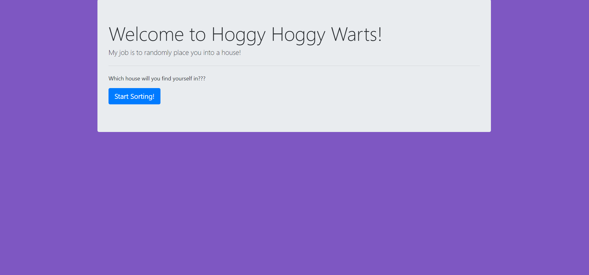

# Sorting-Hat

## Description
This project is an exploration into dynamically creating page elements using JavaScript eventlisteners. Clicking the button populates a form, and that information creates a card with the student info on it.

## Screenshots

## How to run
1. Clone down this repo
1. Make ure you have http-server installed via npm. If not get it [here](https://www.npmjs.com/package/http-server)
1. On your command line, run `hs -p 9999`
1. In your browser go to `http://localhost:9999`
